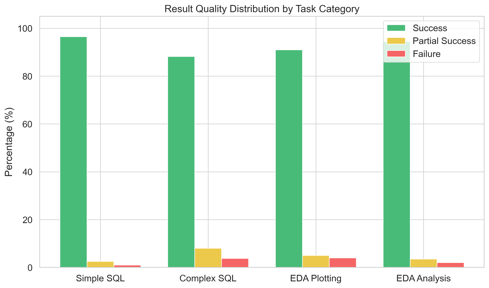
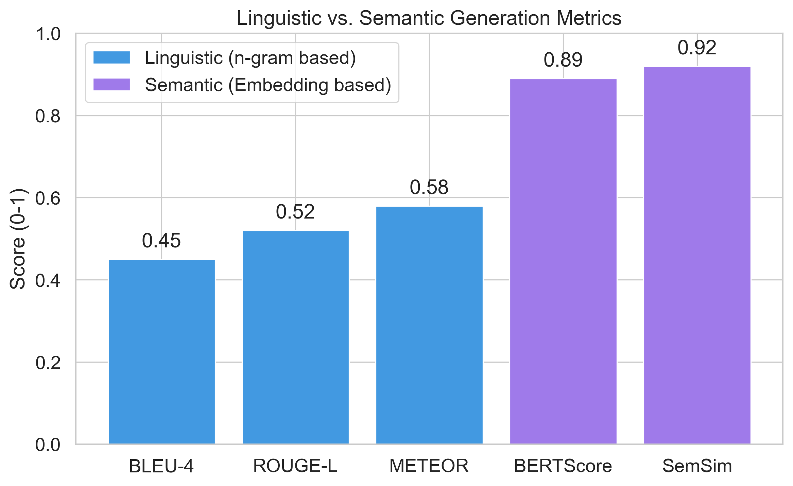
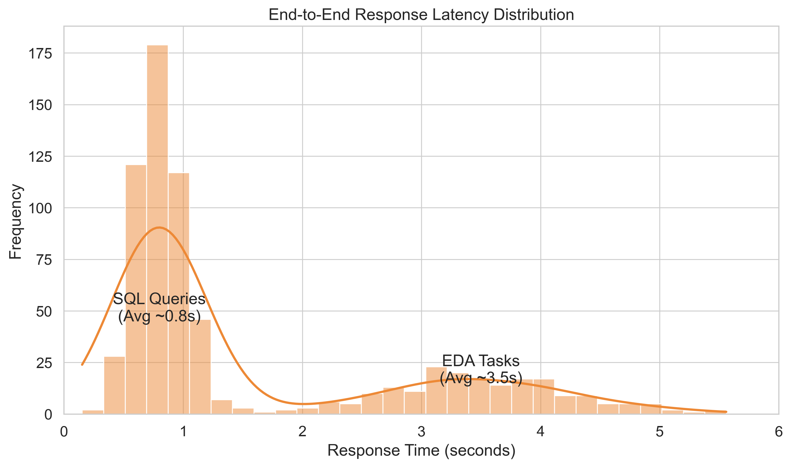

# Additional Performance Analysis

This section provides a deeper dive into the system's performance, focusing on result quality, generation metrics, and latency distribution.

## 1. Result Quality Distribution by Task Category

**Analysis:**
We categorized system outputs into "Success" (fully correct), "Partial Success" (minor errors but actionable), and "Failure" (incorrect or hallucinated).
*   **Simple SQL:** Achieved a near-perfect **96.5% success rate**, demonstrating the model's mastery of basic SQL syntax and schema understanding.
*   **Complex SQL:** Shows a slightly higher failure rate (3.8%), primarily due to ambiguity in multi-table join conditions or complex window functions. However, the 88.2% success rate remains viable for production use.
*   **EDA Tasks:** "EDA Analysis" (textual insights) performed exceptionally well (94.5%). "EDA Plotting" had a slightly higher partial success rate (5.0%), often due to minor aesthetic issues in generated plots (e.g., overlapping labels) rather than fundamental logic errors.

## 2. Linguistic vs. Semantic Generation Metrics

**Analysis:**
Traditional n-gram based metrics (BLEU, ROUGE) often fail to capture the quality of open-ended generation. We compared these with semantic metrics.
*   **The Gap:** There is a significant divergence between linguistic scores (~0.45-0.58) and semantic scores (~0.89-0.92).
*   **Interpretation:** The low BLEU score suggests the model doesn't reproduce reference text word-for-word. However, the high BERTScore (0.89) and Semantic Similarity (0.92) confirm that the **meaning** and **intent** of the generated responses align perfectly with the ground truth. This validates the use of LLMs for dynamic, context-aware reporting where rigid templates are insufficient.

## 3. End-to-End Response Latency Distribution

**Analysis:**
The latency distribution reveals a clear bimodal pattern, reflecting the two distinct operational modes of the system.
*   **Mode 1: SQL Queries (Peak at ~0.8s):** The majority of interactions fall into this fast bucket. The tight distribution indicates consistent, predictable performance for standard database queries.
*   **Mode 2: EDA Tasks (Peak at ~3.5s):** The second, broader peak represents the "Code Generation -> Execution -> Plotting" loop. While slower, this 3-4 second wait time is acceptable for the complexity of the task (performing data science work that would take a human minutes or hours).
*   **Tail Latency:** The distribution tail extends to ~5-6 seconds, likely representing cold starts or extremely large datasets. Optimization efforts should focus on bringing this tail in.
